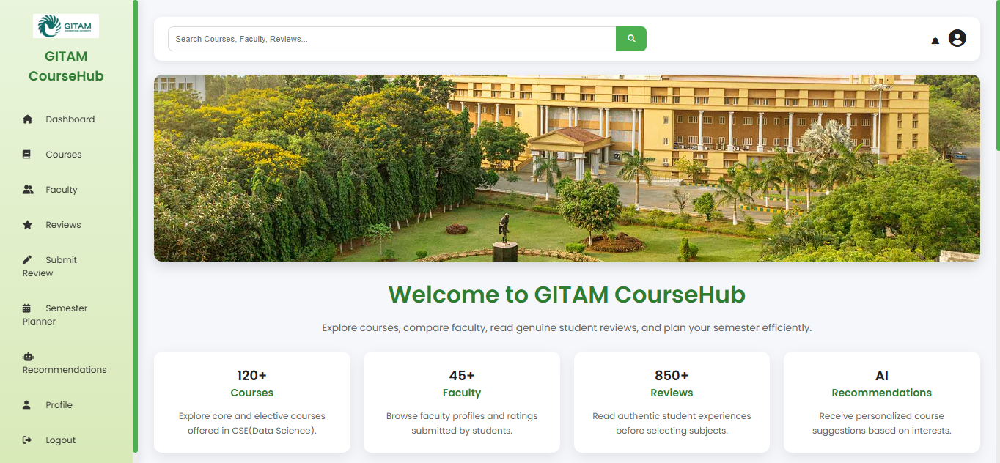
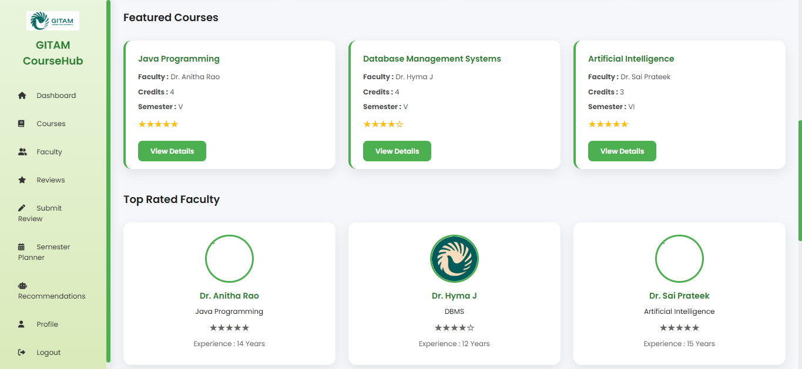
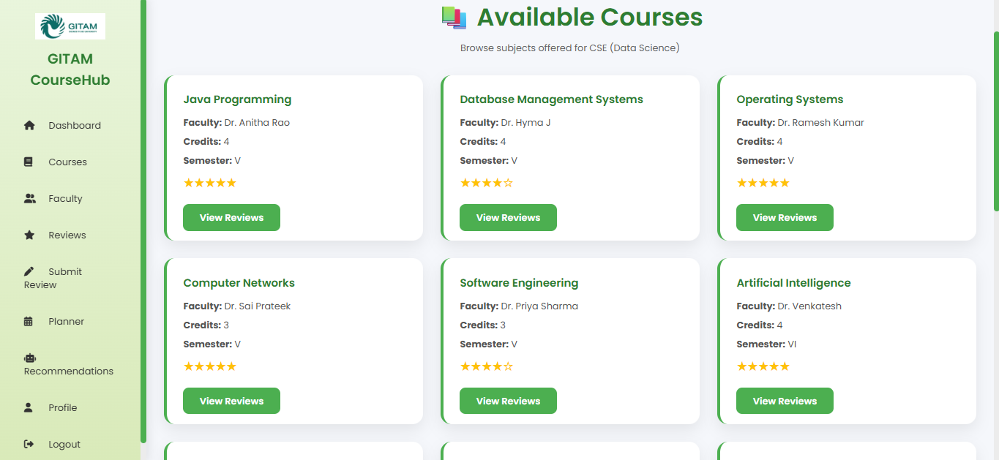
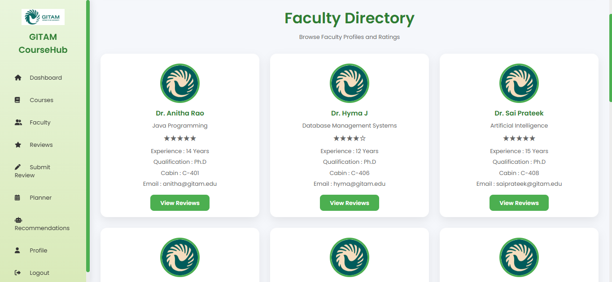
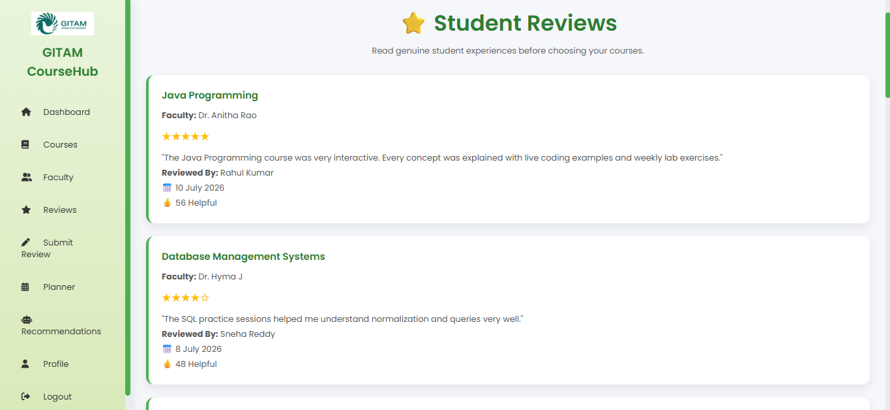
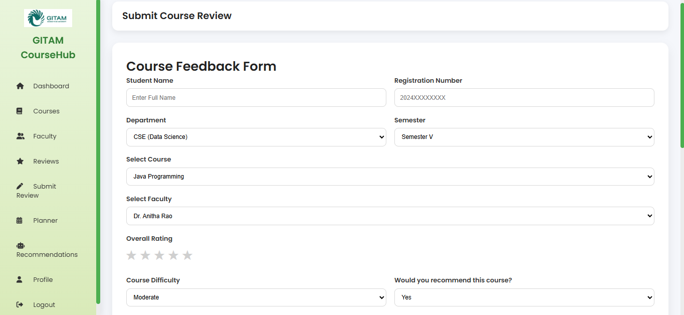
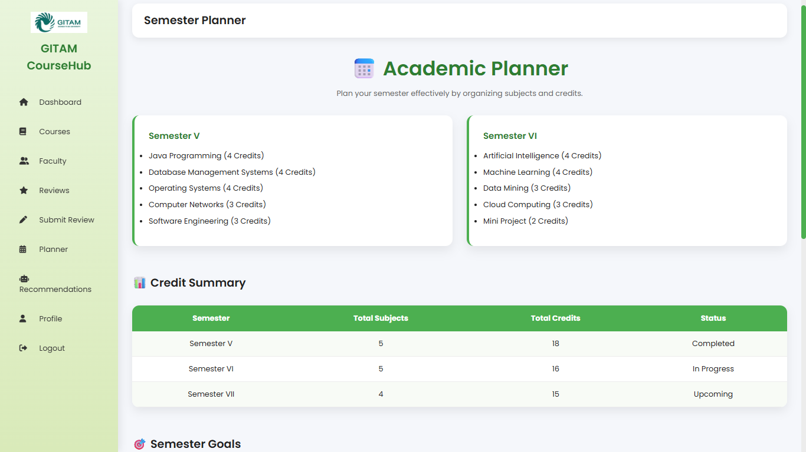
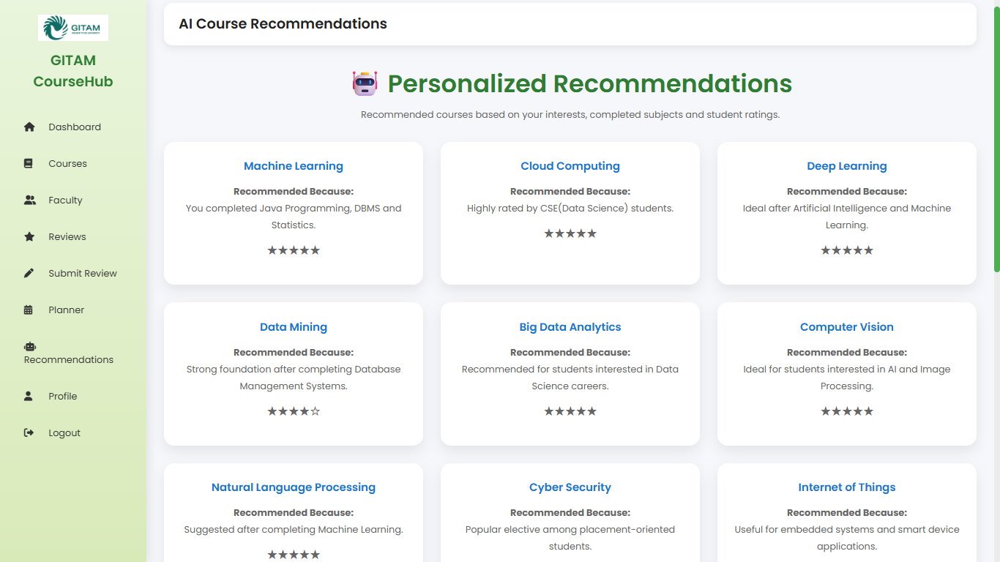
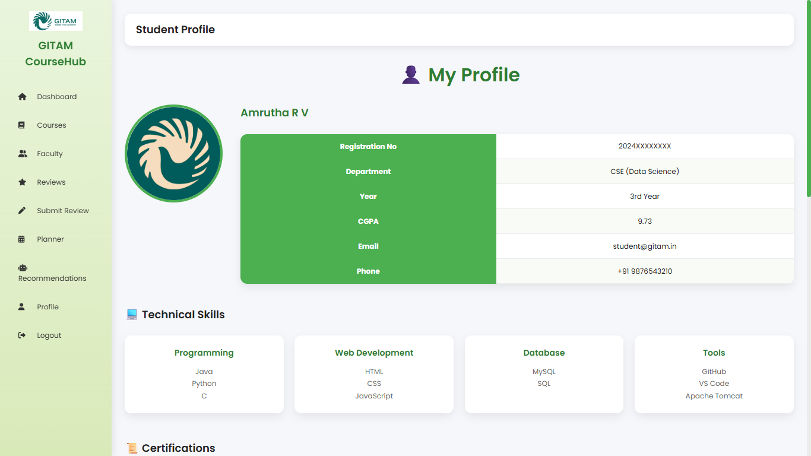

## GITAM CourseHub

GITAM CourseHub is a web-based academic portal developed specifically for GITAM University students to explore courses, review faculty members, and plan their academic journey. The platform helps students make informed decisions by providing course information, faculty ratings, student reviews, semester planning, and personalized course recommendations.

---

### Key Features

#### 1. Course Directory
Students can browse courses offered under the Computer Science & Engineering (Data Science) program, including course credits, semester details, and faculty information.

#### 2. Faculty Profiles
View faculty members along with their subjects, qualifications, teaching experience, ratings, and contact information.

#### 3. Student Reviews
Students can read reviews submitted by other students to understand course difficulty, teaching quality, and learning experience.

#### 4. Submit Reviews
Students can submit course reviews by selecting the course, faculty, rating, workload, and providing detailed feedback.

#### 5. Semester Planner
A dedicated planner helps students organize their semester subjects, monitor credits, and keep track of important academic events.

#### 6. Personalized Course Recommendations
Provides course recommendations based on completed subjects, interests, and career goals such as Software Development, Artificial Intelligence, Data Science, and Cloud Computing.

#### 7. Student Profile
Students can view their academic profile, technical skills, certifications, achievements, internships, and recent activities.

---

## Technologies Used

### Frontend

- HTML5
- CSS3
- JavaScript

### Backend (Architecture)

- Java
- JSP
- Servlets
- JDBC

### Database

- MySQL

### Development Tools

- Apache Tomcat 10
- Visual Studio Code
- Git
- GitHub

---

## How It Works

1. Students register using the registration page.
2. Users log in to access the student dashboard.
3. Browse available courses and faculty profiles.
4. Read reviews submitted by other students.
5. Submit course and faculty reviews.
6. Plan the semester using the Semester Planner.
7. View AI-based course recommendations.
8. Manage academic profile and achievements.

---

## Future Enhancements

- AI-powered recommendation engine using Machine Learning
- Admin Dashboard
- Student authentication using University ID
- Email notifications
- Live search
- Course comparison
- Faculty ranking analytics
- Mobile responsive improvements
- Interactive charts using Chart.js

---

## Screenshots

### Home

### Dashboard

### Courses

### Faculty

### Reviews

### Submit Review

### Semester Planner

### Recommendations

### Profile

---

## Developed By

**Amrutha Ratna Valli**
B.Tech – Computer Science & Engineering (Data Science)
GITAM (Deemed to be University)
